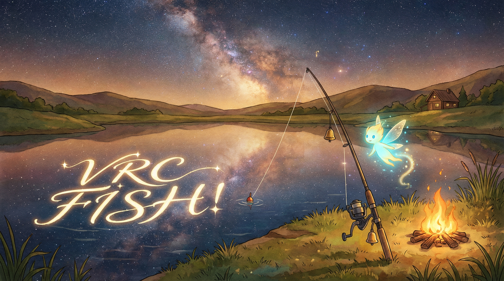

<div align="center">
  
</div>

<div align="center">
  <h1>VRChat FISHǃ Auto Fishing Assistant — Improved Fork</h1>
  <p>Windows · C++ · OpenCV 4.6.0 · Template &amp; Color Matching · Physics + MPC (Optional ML)</p>
  <p>
    <b>English</b> · <a href="README.md">中文</a>
  </p>
  <p>
    
    
    
    
  </p>
</div>

> This is a fork of [abligail/vrc-fish](https://github.com/abligail/vrc-fish), licensed GPL-3.0. The original project was built as an assistive tool for a friend with motor impairments; this fork builds on that foundation with a round of reliability and tuning fixes gathered from real-world testing (see [What's Improved in This Fork](#whats-improved-in-this-fork) below).
>
> Fishing should be relaxing — please keep it casual and follow VRChat's Terms of Service.

<details>
  <summary><b>Table of Contents</b></summary>

- [What's Improved in This Fork](#whats-improved-in-this-fork)
- [Acknowledgements](#acknowledgements)
- [Overview](#overview)
- [Features](#features)
- [Target World](#target-world)
- [Quick Start](#quick-start)
- [Tuning \& Adaptation](#tuning--adaptation)
- [Build](#build)
- [Configuration](#configuration)
- [Logging \& Debugging](#logging--debugging)
- [Experimental Scripts (Optional)](#experimental-scripts-optional)
- [Project Layout](#project-layout)
- [Support \& Contributing](#support--contributing)
- [Disclaimer](#disclaimer)
- [License](#license)

</details>

---

## What's Improved in This Fork

Everything below was driven by real testing sessions, not speculative tuning — each item traces back to a reproducible failure pattern caught in the debug logs.

- **Stale track recovery.** Previously, once the slider track was located at the start of a minigame, that lock was never re-verified for the rest of the round. If something disrupted the frame right at lock-on (fog rolling in, the lure-launch animation), the bot would keep polling a now-invalid region until the whole minigame timed out. A bounded re-lock now triggers automatically after a short run of misses, with its own capped miss budget so it can't silently delay a *normal* minigame ending either.
- **Fixed a false lock onto VRChat's own HUD.** The initial track-search area covered the full screen height, including the bottom HUD band (level/coins icon, health bar). Under weaker lighting (night, heavy fog), that static icon could occasionally outscore the real track bar, causing the bot to lock onto something that never moves — which looked exactly like the bot being frozen. The search area now excludes that band, and a separate stuck-position watchdog catches anything that still slips through.
- **Weather-adaptive slider brightness.** The slider's color detection used a single fixed brightness cutoff, which broke whenever ambient lighting shifted (fog, day/night cycles). It now derives a brightness threshold from the current frame when there's enough contrast to do so safely, and falls back to the fixed value on flat/empty regions so it doesn't invent false detections where there's nothing to detect.
- **Smoother, more consistent slider control.** The velocity/acceleration smoothing fed into the MPC controller was barely filtering any detection noise, which showed up as the on-screen slider reacting too sharply and inconsistently. Smoothing is now tuned to damp that noise before it reaches the control decision.
- **Expanded fish-icon recognition.** Added template support for additional fish-icon variants (including a gear-shaped icon) that weren't previously recognized, so more valid bites get caught instead of missed.
- **Minor threshold tuning** to reduce occasional single-frame misses under foggy conditions.

## Acknowledgements

- Thanks to the original author of [abligail/vrc-fish](https://github.com/abligail/vrc-fish) for the base project this fork builds on.
- Thanks to **aflotia** (VRChat player) for tuning better parameters and contributing template images to the original project.

---

## Overview

A small Windows tool that assists the VRChat fishing minigame by detecting key UI elements (OpenCV template matching and color-based detection) and controlling the minigame via <kbd>Left Mouse Button</kbd> press/release.

This repository focuses on the fishing logic, detection reliability, control tuning, and experimental scripts for the **VRChat world FISHǃ**.

## Features

- Fully automated loop: cast → wait for bite → hook → control minigame → cleanup → next round
- Detection:
  - `matchTemplate`: bite prompt, minigame track, fish icon(s), slider template (fallback)
  - Weather-adaptive brightness-based slider boundary detection on the track column (primary)
  - Automatic re-lock on stale/lost tracking instead of running out the clock on a bad lock
- Control: a lightweight physics model + MPC (Model Predictive Control) to decide hold/release, with smoothing tuned to resist detection noise
- Optional ML workflow: record data / inference mode + analysis & fitting scripts

## Target World

This project is mainly tuned for **FISHǃ**:
- World URL: https://vrchat.com/home/world/wrld_ae001ea3-ed05-42f0-adf2-3d47efd10a77
- World ID: `wrld_ae001ea3-ed05-42f0-adf2-3d47efd10a77`

Templates, thresholds, and ROIs are calibrated for the current UI of this world. If the world/UI updates, re-capture templates under `Resource-VRChat/` and adjust `config.ini`.

## Quick Start

1. In VRChat display/graphics settings, set the resolution to `1280×960` (matches the default templates in this repo).
2. Enter **FISHǃ** in VRChat, make sure you are ready to fish and the fishing UI is visible (do not cover it with other windows).
3. After casting, choose a position/view so that the bite indicator (the dot at the bottom of the exclamation mark) and the full minigame slider track are visible on screen (not cropped/occluded).
4. Adjust `config.ini` if needed (window matching, resolution, thresholds, cleanup parameters), then run `vrc-fish.exe`. If `is_pause=1`, press <kbd>Tab</kbd> to pause/resume.

Notes:
- The project enables `RequireAdministrator` by default, so the app may require admin privileges.
- For stable template matching, the app can force VRChat client-area resolution via `force_resolution`.
- The app reads `config.ini` from the current working directory and loads templates from `resource_dir` (default `Resource-VRChat/`). Run it from the repo root, or copy `config.ini` and `Resource-VRChat/` next to the executable.

## Tuning & Adaptation

The bundled templates and default parameters are based on a specific fishing spot and avatar height. Current parameters reliably catch the vast majority of fish at that spot; further tuning for other locations is welcome via contributions.

If detection is not working well in your setup, adjust in the following priority:

### 1. Adjust Track Template Scale Range (Most Common)

Different positions, avatar heights, fishing rods, and resolution/UI scaling will cause the slider track to appear at different sizes on screen. The program uses multi-scale template matching to handle this. The relevant parameters are:

```ini
track_scale_min=0.8
track_scale_max=2
track_scale_step=0.2
```

**How to adjust**: Run the program with `debug=1` and watch the console log for the `scale` value printed when the track is successfully matched (e.g. `scale=1.4`). Once you know the approximate scale range for your setup, narrow the search range around that value and reduce the step size for better precision. For example, if you observe scale values around `1.2~1.6`, set:

```ini
track_scale_min=1.0
track_scale_max=1.8
track_scale_step=0.1
```

- If the matched scale is close to `track_scale_min` or `track_scale_max`, the search range may be too narrow—expand it in the corresponding direction.
- A smaller `track_scale_step` gives more accurate matching but increases computation. Usually `0.1~0.2` is sufficient.

### 2. Keep the Slider Track as Vertical as Possible

The program assumes the slider track is roughly vertical on screen. If your position/view angle causes noticeable tilt, there are two approaches:

- **Recommended**: Adjust your in-game position or camera angle so the fishing track appears as vertical as possible on screen.
- **Compensate via config**: Enable angle search parameters to let the program detect small rotations automatically:
  ```ini
  track_angle_min=-5.0
  track_angle_max=5.0
  track_angle_step=1.0
  ```
  You can check the `angle` value in the log output to confirm the actual tilt, then narrow the range and reduce the step size for better accuracy. Note that angle search multiplies computation cost, so only enable it when needed.

### 3. Detection Accuracy & Control Smoothness

- **Lots of "miss" in the logs**: If tuning scale/angle doesn't help enough, the most effective fix is to take your own screenshots at your fishing spot, crop the UI elements, and replace the images in `Resource-VRChat/`. Fish-icon variants can be added without any config change — see [Configuration](#configuration) below. You can also tweak matching thresholds (`bite_threshold`, `fish_icon_threshold`, etc.) in `config.ini`.
- **Slider feels jittery or inconsistent**: lower `velocity_ema_alpha` and `fish_accel_alpha` (try `0.2`–`0.3`) to smooth out detection noise before it reaches the controller. If it's still too reactive after that, try raising `reactive_grow_threshold` or lowering `bb_drag` slightly — change one at a time so you can tell what helped.
- **Bot seems to freeze mid-round**: check the debug log for `stuck-slider watchdog fired` or `consecutive miss threshold hit` — both indicate the bot recovered from a bad lock automatically. If it still doesn't recover, try lowering `track_relock_miss_frames` or `stuck_slider_watchdog_frames` in `config.ini`.
- **Different PC / display environments**: Detection accuracy is sensitive to screen resolution and rendering settings. You may need to adjust thresholds and control parameters for your specific setup.

## Build

1. Open `vrc-fish.sln` with Visual Studio
2. Select `x64` + `Release` (or `Debug`)
3. Build `vrc-fish.exe`

Dependencies:
- OpenCV 4.6.0: headers/libs are organized under `include/` + `lib/`, and the runtime `opencv_*460.dll` should be placed next to the executable (the repo root already includes these DLLs).
- For VS Code, see `.vscode/tasks.json` (`Build Release`) and adjust paths for your local VS installation.
- Make sure the runtime can locate `config.ini` and `Resource-VRChat/` (set the working directory to the repo root, or copy required files to your output folder).

## Configuration

Config file: `config.ini` (the file contains inline comments, in Chinese and English).

Key highlights:
- Window matching: `window_class`, `window_title_contains`
- Resolution: `force_resolution`, `target_width`, `target_height`
- After cast: `cast_mouse_move_dx`, `cast_mouse_move_dy` (moves the mouse slightly; restored at end of the round)
- Thresholds: `bite_threshold`, `minigame_threshold`, `fish_icon_threshold`, `slider_threshold`
- Template matching: track lock uses `track_scale_*` / `track_scale_min`/`track_scale_max`/`track_scale_step` / `track_angle_*` (range-based scale+angle scan supported)
- Detection reliability (new in this fork): `track_relock_miss_frames`, `slider_bright_auto`, `search_bottom_margin_pct`, `stuck_slider_watchdog_frames`
- Control smoothing (tuned in this fork): `velocity_ema_alpha`, `fish_accel_alpha`
- Cleanup loop: `cleanup_*`, `cleanup_reel_key`
- ML: `ml_mode` (0=auto, 1=record, 2=infer), `ml_record_csv`, `ml_weights_file`
- Debug/log: `debug`, `debug_pic`, `debug_dir`, `vr_log_file`

Templates:
- Default directory: `Resource-VRChat/` (override via `tpl_*` keys)
- Fish icons: auto-loads `fish_icon_alt*.png` (e.g. `fish_icon_alt13.png`) without requiring config entries — just crop and resize to match the existing templates' dimensions and drop the file in

## Logging & Debugging

- `debug=1`: prints scores, state transitions, and control info to the console
- `debug_pic=1`: saves key-frame screenshots under `debug_dir`
- `vr_log_file`: appends runtime logs to a file (see examples under `data/logs/`)

## Experimental Scripts (Optional)

Scripts live in `scripts/`:

- `fit_physics.py`: fit slider physics parameters from debug logs
- `analyze_log.py` / `analyze_oscillation.py`: analyze overshoot/oscillation behavior
- `train_bc.py`: behavior cloning training (requires `numpy`), outputs weights for `ml_mode=2`

## Project Layout

- `vrc-fish.cpp`: main app (capture, detection, state machine, control, cleanup)
- `config.ini`: configuration
- `Resource-VRChat/`: UI templates for FISHǃ
- `data/`: logs, sample data, ML weights
- `scripts/`: analysis / fitting / training utilities

## Support & Contributing

If you find this project helpful, a Star would be much appreciated!

This is a fork maintained in spare time — issues and pull requests are welcome, especially reliability fixes backed by debug logs.

## Disclaimer

- This is NOT an official VRChat project and is not affiliated with VRChat.
- Please follow VRChat and related service terms/rules. Use at your own risk.
- This repository is shared for learning/research purposes with no warranty. Please do not use it to harm others' experience, violate service terms, or for other improper purposes.
- The above guidance is informational and is not an additional restriction on the GPL-3.0 license terms.

## License

The source code of this project is licensed under GPL-3.0, same as the original project it's forked from. See `LICENSE`. Third-party components/assets in this repository may be under different licenses or rights notices; see `THIRD_PARTY_NOTICES.md`.
